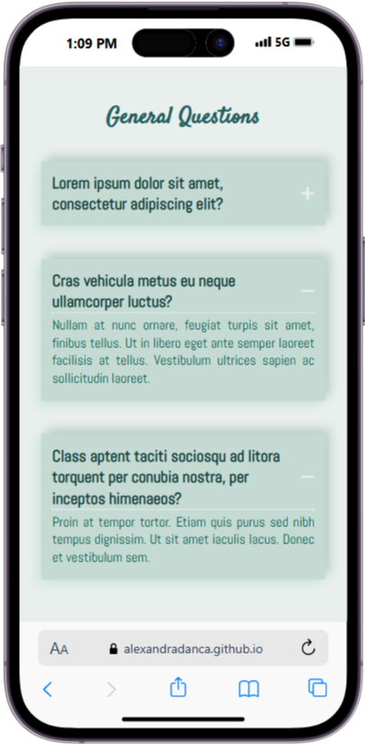
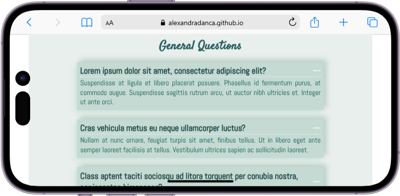

<h2 align="center">
 :question: <a href="https://alexandradanca.github.io/Questions-box/" target="_blank">Q&A section</a>
</h2>

An organized and informative section to address frequently asked questions for improved user support.  It was created during front-end learning journey

## Built With
- HTML
- CSS
- JavaScript

## Features

**🎨 Styled just with CSS**

**📱 Fully Responsive**

<h2>Mockup Phone</h2>

 
  
  

<h2>Mockup mp4</h2>

  

https://github.com/user-attachments/assets/82e51109-2d74-4c84-9777-6dd77837f0dc

